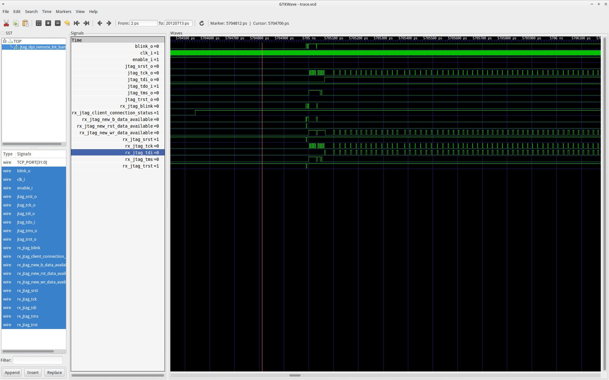

# Basic openocd configuration

If you are hand building openocd, then build:
	./configure --enable-remote-bitbang

# Adapter configuration
Bare minimum adapter configuration is provided:
http://openocd.org/doc/html/Debug-Adapter-Configuration.html

See provided [testing_remote_bitbang.tcl](testing_remote_bitbang.tcl)

# Startup
	openocd -f testing_remote_bitbang.tcl

# signalling:
When built with TRACE=1, the captured waveform looks like this:



# Next steps

##Discovering TAPs

http://openocd.org/doc/html/TAP-Declaration.html
http://openocd.org/doc/html/TAP-Declaration.html#autoprobing

Currently, we get:
```
$ openocd -f  testing_remote_bitbang.tcl
Open On-Chip Debugger 0.10.0+dev-00166-g0e4fbfba03e7 (2017-07-02-09:09)
	Licensed under GNU GPL v2
	For bug reports, read
		http://openocd.org/doc/doxygen/bugs.html
Warn : Adapter driver 'remote_bitbang' did not declare which transports it allows; assuming legacy JTAG-only
Info : only one transport option; autoselect 'jtag'
trst_and_srst separate srst_gates_jtag trst_push_pull srst_open_drain connect_deassert_srst
RCLK - adaptive
Info : Initializing remote_bitbang driver
Info : Connecting to localhost:9000
Info : remote_bitbang driver initialized
Info : This adapter doesn't support configurable speed
Warn : There are no enabled taps.  AUTO PROBING MIGHT NOT WORK!!
Error: JTAG scan chain interrogation failed: all ones
Error: Check JTAG interface, timings, target power, etc.
Error: Trying to use configured scan chain anyway...
Warn : Bypassing JTAG setup events due to errors
Warn : gdb services need one or more targets defined

```

Which is expected since we hold jtag_tdo_i to 1 in our test bench

On the other hand, if we change to:
  top->jtag_tdo_i = 0;

Then we get:
```
Open On-Chip Debugger 0.7.0 (2013-10-22-08:31)
	Licensed under GNU GPL v2
	For bug reports, read
		http://openocd.sourceforge.net/doc/doxygen/bugs.html
Warn : Adapter driver 'remote_bitbang' did not declare which transports it allows; assuming legacy JTAG-only
Info : only one transport option; autoselect 'jtag'
Info : Initializing remote_bitbang driver
Info : Connecting to localhost:9000
Info : remote_bitbang driver initialized
Info : This adapter doesn't support configurable speed
Warn : There are no enabled taps.  AUTO PROBING MIGHT NOT WORK!!
Error: JTAG scan chain interrogation failed: all zeroes
Error: Check JTAG interface, timings, target power, etc.
Error: Trying to use configured scan chain anyway...
Error: IR capture error at bit 0, saw 0x00 not 0x...3
Warn : Bypassing JTAG setup events due to errors
Warn : gdb services need one or more targets defined

```

But this kind of proves that we might infact be able to use openocd
remote bitbang to connect to this module which inturn could be
connected to a real SoC
